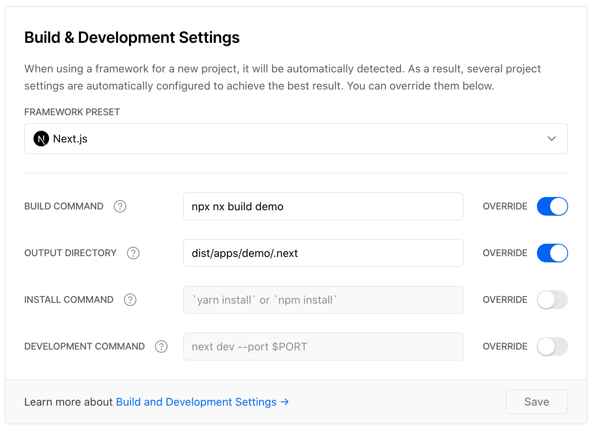

# Demo of using Nx + Next.js + Vercel
*test*

This repo is a demo of how to develop Next.js apps in Nx, and use the affected logic in Vercel deployments.

There are two apps in this repo: `apps/demo` and `apps/hello-world`. You can run the apps as follows locally.

```bash
yarn

npx nx serve demo
npx nx serve hello-world
```

Then, in Vercel there are two projects in the same GitHub monorepo: `acme-demo` and `acme-hello-world`.

For the `acme-demo` app, these are the settings used.

**General Settings**



**Git Settings**


The same settings are applied to `acme-hello-world`, but `demo` is replaced with `hello-world` in the build command and output directoy.

## How it works

The ignore build script installs both `gh` and `nx` CLI tools to find our _base_ and _head_ git refs, and then figure out if our app is affected.

See [./tools/scripts/ignore-build.sh](tools/scripts/ignore-build.sh) shell script for the implementation.

## Why?

Nx can tell us which apps are affected in the branch by looking at the changed files, and finding the apps that have dependencies to those files.

For example,

```
npx nx affected:apps --base main --head HEAD
```

The above command will compare our current `HEAD` ref to `main`, and list out all the apps affected by the change.

Nx affected logic allows us to:

1. Skip deployments for apps that are not affected
2. Continue to build if one of the dependencies of the apps have changed (including npm packages)

Point #2 is important because only apps using the changed workspace libs or npm packages should be deployed. This is not easy to do without using Nx.


Nx uses the project graph (seen below) to figure out what is affected.


